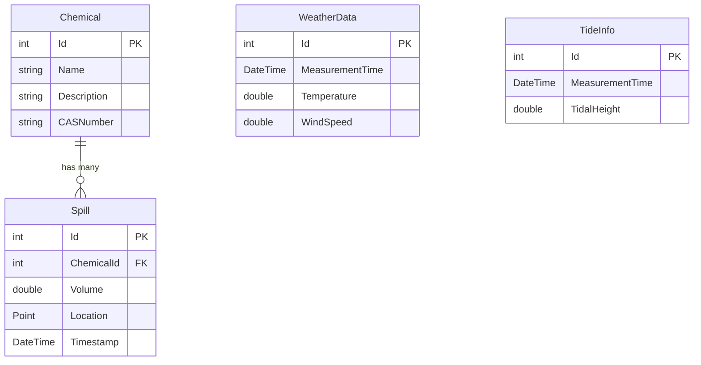

# Domain Models Documentation

## Overview

The domain models represent the core entities in the Chemical Water Dispersion system. These models define the data structure and relationships for managing chemical spills, environmental conditions, and simulation data.

## Model Relationships



## Core Models

### Chemical

Represents a chemical substance that can be involved in spills.

**Properties:**
- `Id` (int): Primary key, auto-generated
- `Name` (string): Chemical name (required, max 64 characters)
- `Description` (string, nullable): Detailed description of the chemical
- `CASNumber` (string, nullable): Chemical Abstracts Service Registry Number

**Usage:**
```csharp
var chemical = new Chemical
{
    Name = "Benzene",
    Description = "Aromatic hydrocarbon compound",
    CASNumber = "71-43-2"
};
```

**Database Mapping:**
- Table: `chemicals`
- Indexes: Primary key on `Id`
- Constraints: `Name` is required and limited to 64 characters

### Spill

Represents a chemical spill incident with location and time information.

**Properties:**
- `Id` (int): Primary key, auto-generated
- `ChemicalId` (int): Foreign key to Chemical entity
- `Volume` (double): Volume of spilled chemical in liters
- `Location` (Point, nullable): Geographic location using NetTopologySuite Point
- `Timestamp` (DateTime): When the spill occurred
- `Chemical` (Chemical): Navigation property to associated chemical

**Usage:**
```csharp
var spill = new Spill
{
    ChemicalId = 1,
    Volume = 150.75,
    Location = new Point(-122.4194, 37.7749) { SRID = 4326 },
    Timestamp = DateTime.UtcNow
};
```

**Geographic Data:**
- Uses PostGIS Point geometry with SRID 4326 (WGS84)
- Coordinates are stored as [longitude, latitude]
- Supports spatial queries and operations

**Database Mapping:**
- Table: `spills`
- Foreign Key: `chemical_id` references `chemicals(id)`
- Spatial Index: On `location` column for efficient geographic queries

### WeatherData

Stores weather conditions that affect chemical dispersion modeling.

**Properties:**
- `Id` (int): Primary key, auto-generated
- `MeasurementTime` (DateTime): When the measurement was taken
- `Temperature` (double): Temperature in Celsius
- `WindSpeed` (double): Wind speed in meters per second

**Usage:**
```csharp
var weather = new WeatherData
{
    MeasurementTime = DateTime.UtcNow,
    Temperature = 22.5,
    WindSpeed = 5.8
};
```

**Database Mapping:**
- Table: `weather`
- Indexes: Consider adding index on `MeasurementTime` for time-series queries

**Future Enhancements:**
- Wind direction
- Humidity
- Atmospheric pressure
- Precipitation data

### TideInfo

Stores tidal information that affects water movement and dispersion patterns.

**Properties:**
- `Id` (int): Primary key, auto-generated
- `MeasurementTime` (DateTime): When the tidal measurement was taken
- `TidalHeight` (double): Tidal height in meters (relative to mean sea level)

**Usage:**
```csharp
var tideInfo = new TideInfo
{
    MeasurementTime = DateTime.UtcNow,
    TidalHeight = 2.1
};
```

**Database Mapping:**
- Table: `tide_info` (to be implemented)
- Indexes: Consider adding index on `MeasurementTime`

**Future Enhancements:**
- Tidal direction/flow
- Current speed
- Location-specific tidal data

## Data Transfer Objects (DTOs)

### SpillDto

Used for client-server communication in the Blazor application.

**Properties:**
- `Id` (int): Spill identifier
- `ChemicalId` (int): Associated chemical ID
- `Volume` (double): Spill volume in liters
- `Latitude` (double, nullable): Geographic latitude
- `Longitude` (double, nullable): Geographic longitude
- `Timestamp` (DateTime): Spill occurrence time
- `ChemicalName` (string, nullable): Chemical name for display

**Mapping from Domain Model:**
```csharp
// Domain to DTO
var spillDto = new SpillDto
{
    Id = spill.Id,
    ChemicalId = spill.ChemicalId,
    Volume = spill.Volume,
    Latitude = spill.Location?.Y,
    Longitude = spill.Location?.X,
    Timestamp = spill.Timestamp,
    ChemicalName = spill.Chemical?.Name
};

// DTO to Domain
var spill = new Spill
{
    Id = spillDto.Id,
    ChemicalId = spillDto.ChemicalId,
    Volume = spillDto.Volume,
    Location = spillDto.Latitude.HasValue && spillDto.Longitude.HasValue
        ? new Point(spillDto.Longitude.Value, spillDto.Latitude.Value) { SRID = 4326 }
        : null,
    Timestamp = spillDto.Timestamp
};
```

## Entity Framework Configuration

### DbContext

The `ChemicalDispersionDbContext` configures entity relationships and database mapping:

```csharp
public class ChemicalDispersionDbContext : DbContext
{
    public DbSet<Chemical> Chemicals { get; set; }
    public DbSet<Spill> Spills { get; set; }
    public DbSet<WeatherData> WeatherData { get; set; }
    public DbSet<TideInfo> TideInfos { get; set; }

    protected override void OnModelCreating(ModelBuilder modelBuilder)
    {
        // Configure Chemical entity
        modelBuilder.Entity<Chemical>(entity =>
        {
            entity.Property(e => e.Name)
                .IsRequired()
                .HasMaxLength(64);
        });

        // Configure Spill entity
        modelBuilder.Entity<Spill>(entity =>
        {
            entity.HasOne(s => s.Chemical)
                .WithMany()
                .HasForeignKey(s => s.ChemicalId);
                
            entity.Property(e => e.Location)
                .HasColumnType("geometry(Point, 4326)");
        });
    }
}
```

### Migrations

Key migrations in the project:

1. **InitialCreate**: Creates basic schema with chemicals and spills tables
2. **AddGeospatialSupport**: Adds PostGIS geometry support
3. **AddWeatherAndTidal**: Adds weather and tidal data tables (future)

## Validation and Business Rules

### Chemical Validation

- Name is required and cannot exceed 64 characters
- CAS Number should follow standard format (future enhancement)
- Description is optional but recommended

### Spill Validation

- ChemicalId must reference existing chemical
- Volume must be positive
- Location should use valid coordinates (longitude: -180 to 180, latitude: -90 to 90)
- Timestamp should not be in the future

### Environmental Data Validation

- Measurement times should be chronologically ordered
- Temperature values should be within reasonable ranges
- Wind speed should be non-negative
- Tidal height values should be reasonable for the location

## Performance Considerations

### Indexing Strategy

1. **Primary Keys**: Automatic clustered indexes
2. **Foreign Keys**: Indexes on `ChemicalId` in Spills table
3. **Spatial Index**: On `Location` column for geographic queries
4. **Time-Series**: Consider indexes on timestamp columns

### Query Optimization

```csharp
// Efficient spill queries with related data
var spillsWithChemicals = await context.Spills
    .Include(s => s.Chemical)
    .AsNoTracking()
    .Take(50)
    .ToListAsync();

// Spatial queries
var nearbySpills = await context.Spills
    .Where(s => s.Location.IsWithinDistance(centerPoint, radiusInMeters))
    .ToListAsync();
```

## Future Model Extensions

### Planned Enhancements

1. **Dispersion Simulation Results**
   - Concentration grids
   - Time-series predictions
   - Affected area polygons

2. **Chemical Properties**
   - Molecular weight
   - Solubility data
   - Toxicity information
   - Environmental persistence

3. **User Management**
   - User accounts
   - Role-based permissions
   - Audit trails

4. **Notification System**
   - Alert thresholds
   - Contact information
   - Escalation rules

### Extensibility Points

The domain models are designed to be extensible:

- Use interfaces for behavior contracts
- Implement repository patterns for data access
- Support for additional environmental data sources
- Plugin architecture for custom dispersion models

## Testing Considerations

### Unit Testing Models

```csharp
[Fact]
public void Spill_ShouldCalculateAffectedArea()
{
    // Arrange
    var spill = new Spill
    {
        Volume = 100,
        Location = new Point(-122.4194, 37.7749)
    };

    // Act
    var affectedRadius = spill.CalculateInitialRadius();

    // Assert
    Assert.True(affectedRadius > 0);
}
```

### Integration Testing

Test database operations with in-memory database or test containers:

```csharp
[Fact]
public async Task DbContext_ShouldPersistSpillWithLocation()
{
    // Arrange
    using var context = CreateTestContext();
    var spill = new Spill { /* test data */ };

    // Act
    context.Spills.Add(spill);
    await context.SaveChangesAsync();

    // Assert
    var saved = await context.Spills.FindAsync(spill.Id);
    Assert.NotNull(saved);
    Assert.NotNull(saved.Location);
}
```